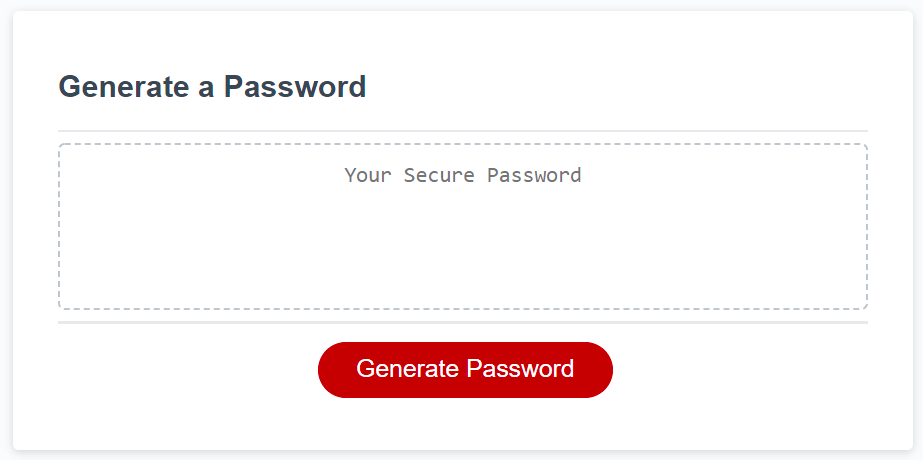

# Random Password Generator

## Purpose
To provide a randomly generated password on the click of a button, while asking questions of what the user wants included in the password.

## Features
* Can give a random password of chosen length
* Can give a random password of chosen character types
* Can give a random password of random length and random characters

## Built with
* HTML
* CSS
* Javascript

## Website

https://nhur2004.github.io/password-generator/

## Contributors
nHur2004